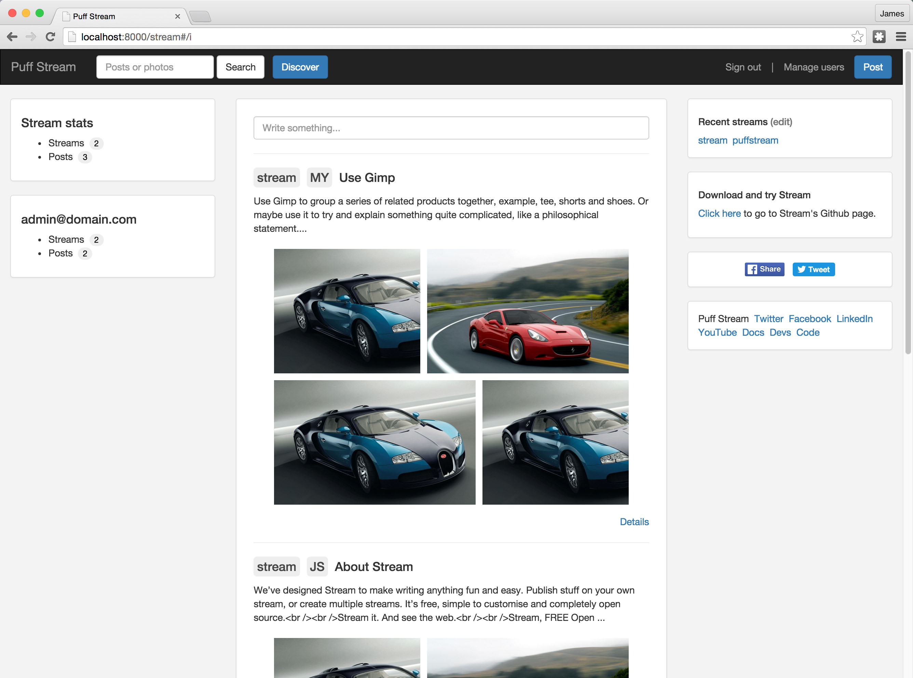

## Overview

Photos and posts streaming software, open source.

#### Here's what I'll be placing my efforts on next:
- Uploading videos to YouTube to talk about Building Software for SaaS (Software as a Service)
- Completing Cloud Module (private) for end-users to join up and try Stream
- Updating readme.md for better installation instructions
- Taking a short breather

#### Screenshot before Cards:

## MIT License
MIT is open-sourced software licensed under the [MIT license](http://opensource.org/licenses/MIT). 
